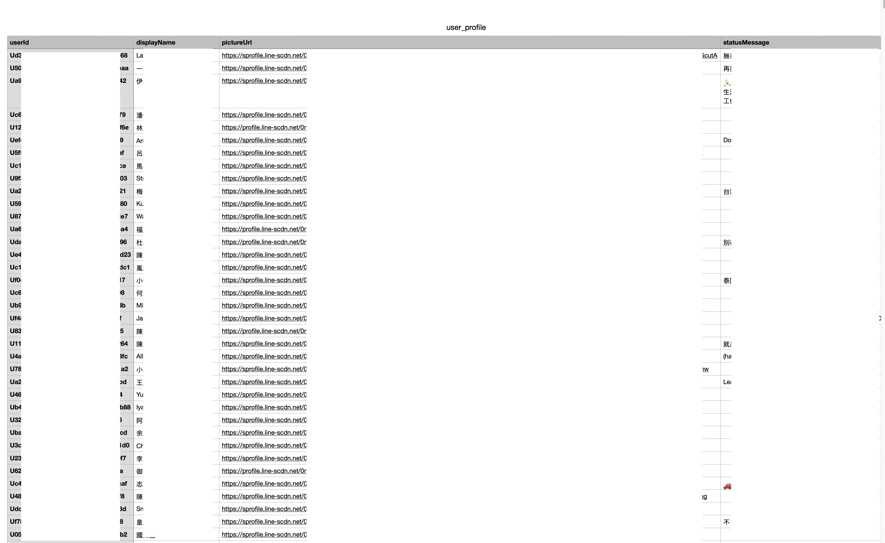
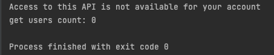
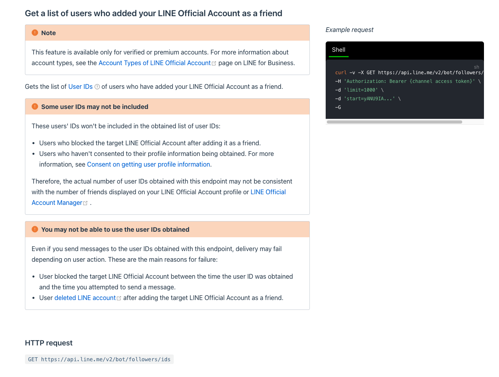

## ParserLINEChannelUserProfile
### Only for verified or premium accounts.
This project is sample to get all channel user's profile and export to csv

### How to use
1. go to [LINE DEV website](https://developers.line.biz/console/)
2. get Messaging API Channel access token
   
   
   
   
3. change config.py 
```python
line_access_token = "Your channel access token"   
```
4. install lib
```
pip install -r requirements.txt
```
5. run main.py
```
python3 main.py
```
6. csv will store in 
```
export/user_profile.csv
```



ps: if you get this message



it's mean your channel not verified or premium account

